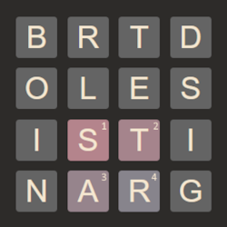

# Word puzzle solver

## Overview
This is a solver to maximize points for word puzzles of sizes roughly up to 6x6. 
Words can be formed by moving between letters horizontally, vertically or diagonally. 
Words of different lengths give varying point bonuses. When a word is played the 
letters are removed, letters above will fall down and the grid will merge to fill empty columns.
A example grid where you play the word "STAR" could look something like this:

Please refrain from using this solver to cheat in word games, that's no fun. This project 
was only done to challenge myself and to see if I could push it to be fast enough to solve 
entire grids.

You can run the solver using `cargo run --release -- <path to dictionary>`. 
The dictionary should contain one word per line, all capital letters, sorted by unicode value. 
You then type in the letters of each grid row, and finally finish the input with an empty line.
While the code does contain some stuff that is specific to Swedish, it should work for
other languages as well (or at least easy to tweak to support other special letters).

## Todos

- Implement iterative version of `solve_puzzle`
- Fix rare bug in `get_dict_tree` leading to infinite loops in `reconstruct_word`