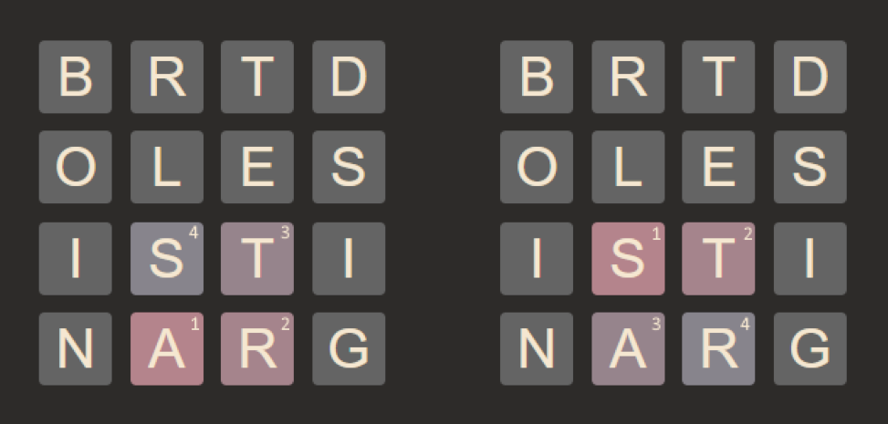

# Ideas and optimizations

On top of using bit logic for just about everything, I've found a few optimizations
that are pretty interesting, at least to me. If you for some reason read through this and the code
and have ideas for further improvements, please share!

## Finding words

At the core of the search lies a function to find all possible words in a given state of grid.
An obvious first implementation is to keep the grid letters and dictionary words as-is in arrays,
and use a binary search to figure out whether each sequence of letters is usable. This works just fine, but
results in many milliseconds or even seconds to find all possible words for just one state. A big
optimization is to use binary search for partial matches as well, and to stop searching further as soon as
there are no potential matches. For example, you've reached the sequence Q-D. You obviously
can't find any words by adding more letters to this sequence, so you unwind the search right away.
However, even with this optimization each word search takes several milliseconds, which is too
slow.

After a while, I rethought the idea of using a linear dictionary. What if you could traverse a tree
instead, and avoid using a binary search from scratch every time? The resulting structure I came up
with contains an index for each letter in the alphabet, and also a single usize where bits are set
for efficient lookups.

```rust
struct Node {
    children: [usize; 31],
    connections: usize,
}
```
*(I know the usize can be too short to store the alphabet on certain targets,
but it's more satisfying to have each node take up exactly 32 usizes worth of memory)*

The idea here is that they can be stored linearly for better locality, but it is still traversed like
a tree. To help explain it, consider the word "BANANA". You start at the root node (which represents
no letter), and move to the index for the letter B. You then check if this node has a connection to the
letter A, and it does! So you move to the corresponding index. The node you're currently at represents
"BA", and you repeat this process the rest of the letters. Each node also has the least significant
bit set if its letters form a valid word, which you can check after reaching the node for "BANANA".
All in all, this means that while searching for words, each entry in the search stack only has to contain
the current letter in the grid, and the current index in the dictionary. As a result, each word lookup can be
done in constant time with

```rust
if dictionary[current_index].connections & 1 == 1 {}
```

Another good idea is to have a data structure for the grid that you can traverse efficiently while forming
letter sequences. You likely want precomputed neighbours for each letter, to avoid computing the neighbours
again and again for every letter while finding words. This becomes quite a bit harder when you also have
the requirement of efficient functions for playing and undoing words in the puzzle search. What I ended up with
was an array of the letter values which stays unchanged for the entire program. What is actually changed during
the search is a u64 containing a set bit for each letter that remains in the grid. The neighbours are computed
just from this u64 bitmap using nothing but bit operations, avoiding the need to move around elements of the
array. It also allows for this lovely undo function!

```rust
fn undo(&mut self, seq: u64) {
    self.remaining ^= seq;
}
```
*(play is always called right after undo, so no recomputing is needed here)*

Naturally you also want to avoid revisiting letters that are already part of the current path. Visited letters
and letter neighbours are both also represented as u64 bitmaps, which avoids the needs for a hashset or similar,
you can simply mask out the available neighbours using

```rust
grid.adjacency[current_index] & !visited
```

## Finding solutions

So after employing these ideas we have a pretty fast word search, usually completing in just a handful of
microseconds. The next step is to figure out how to search through possible solutions of a puzzle to find the
best one. A simple naive implementation won't do even if the word search at each grid state is fast, since
the number of possibilities for a decently sized grid explodes into many many billions or even trillions.
We need to prune!

At any given grid state, we need to be able to decide whether a further search has any possibility of yielding
a better solution. This is done by looking at the points achievable under ideal conditions with the remaining
number of letters, and checking whether it can surpass the current max points found. For example, assume the
following. We have played nothing but short no-bonus words so far, eight letters remain, and we have twelve
bonus points left to reach a new best solution. Even if it is possible to finish off with a spectacular
eight-letter word, giving ten bonus points, it can't possibly result in a better solution that what we already
found, so we can safely stop searching here.

However, implementing this on its own will not suffice. What if we find all the good solutions towards the end
of the search? Then we can't prune at all! Luckily, for the large majority of grids it likely that playing long
words in the beginning will yield the best or at the very least good solutions. We can force searching for these
first by simply sorting the output from the word search, by word length. This drastically cuts down on the total
number of search nodes, and at this point we're pretty close to 6x6 grids being doable in a reasonable amount of
time. To really drive home how important this step is, I checked the total nodes searched with and without this
optimization for a randomized 4x4 grid. It went from 744885 to 938.

Another important realization is that different words may result in the same grid state. For example, in the grid
shown below, both "ARTS" and "STAR" use the exact same letters so it is pointless to search both of them.



Playable words are also stored as u64 bitmaps of the letters used (and the corresponding index in the dictionary).
The sorting is done only based on the bitmap however, and if you also sort equal-length words by their raw bitmap
value (which is the exact same for "ARTS" and "STAR" here), you will line up duplicates next to each other 
so they can be skipped.

The final piece of the puzzle to defeat 6x6 grids, pun intended, was to start caching results for grid states.
This was not completely obvious, since you don't always get a definitive result from a state if you prune the 
search. You can't assume that you will prune again if you reach the same state, since you might have more points
the next time. What we can figure out at each node, however, is an 
upper bound of maximum points reached. After its children in the recursive search have returned, you can compare 
the current points at this node to the maximum points achieved. You can guarantee that it is not possible to achieve 
more points that this difference, and you can use these upper bounds to terminate even more searches. Quite simple to
implement with this knowledge in hand:

```rust
if let Some(upper_bound) = cache.get(&grid.remaining) {
    if points + upper_bound <= max_points {
        return;
    }
}

...

cache.insert(grid.remaining, max_points - points);
```